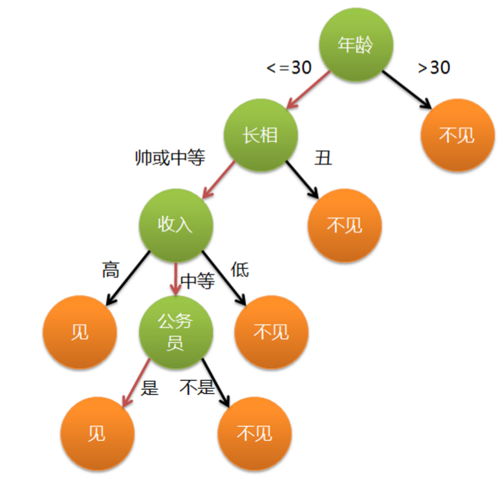

# 大数据时代下的Python

## 主讲：崔译

## 一、集体智慧编程

### 1、集体智慧

> 为了创造新的想法，将一群人的想法（偏好，行为或者思想）组合在一起
>
> 原始时代：调查问卷
>
> 现在：大数据（数据集）  --->  爬虫

### 2、机器学习

ML, Machine Learning . 

是 人工智能 领域与**算法相关**的 子域

它是通过数据建模和分析，让机器不断的进行自我学习

> 3   5
>
> 4   6
>
> 5   7
>
> 6   ?

**原理：**

> 对于所有的非随机数据，在这些数据中，存在着某种"模式"，正是因为这种“套路”，才使得机器学习成为可能

> 机器对数据进行分析和归纳 从而找到这种模式，然后在喂以 大量的数据，得到模型

## 二、常用机器学习算法

### 1、分类

#### 1-1 监督式学习

该算法由一个目标变量 或 结果变量组成，该变量由 已知的一系列变量（大数据/数据集/）预测而来，利用数据集，机器可以生成一个将输入映射到输出的 函数，该过程会持续进行，直到得到一个期望的精确度

**有模式（套路）可寻的**

#### 1-2 非监督式学习

在这种学习算法中，没有任何的变量或者结果进行预测。这一类学习算法用于 细分客户群，

根据不同的特征对客户群进行分类

#### 1-3 强化学习

> 这种算法 训练机器 进行某种决策，
>
> 机器被放在一个能让他通过反复的试错来训练自己的环境中
>
> 机器从过去的学习中总结经验，并且尝试利用了解最透彻的只是作出精准的判断（决策）

### 2、常见算法

**基本原理，所涉及的数学概念以及应用场景（能解决的问题）**

#### 2-1、线性回归

> 线性回归通过拟合一条最相近的直线来建立自变量(x)和因变量(y)的关系

这条线我们使用 
$$
y = Kx + B
$$
表示，叫做 **回归线**

#### 2-2、逻辑回归

**不是回归算法，是一种分类算法**

> 根据已知的因变量估计离散值
>
> 通过拟合一个逻辑函数来推断某件事情发生的概率
>
> 所以，对于逻辑回归，它所产生的值介于[0,1]

#### 2-3、决策树

> 被常用于分类问题或者分类人群，将一系列问题或者一个人群**根据某个重要特征**分成多组

#### 2-4、KNN（K 最近邻算法）

常用于分类问题，存储所有的案例，通过周围的K个案例的大多数情况划分新的案例，根据距离函数，找出最近的“邻居“

#### 2-5、SVM (支持向量机 )

#### 2-6、朴素贝叶斯

#### 2-7、K均值算法

#### 2-8、随机森林算法

#### 2-9、降维算法

#### 2-10、Adaboost算法

## 三、推荐系统的设计和实现

**基于K-NN 的  协同过滤算法的  图书推荐系统**

### 1、基于内容的推荐系统

> 基于内容的推荐系统
>
> ​	会考虑的是商品的实际属性（商品的描述，价格，品牌等等....）

**存在盲区：**

- 绝大多数电商网站已经能够让人根据商品特征进行数据检索
- 无法实现所谓的 “驱动销售增量”

### 2、K-NN  之 协同过滤算法

> 如果你周围很多人（**和你具有相同或者相似的喜好的人**）都买了某个商品，你也很有可能去买

**对于系统而言，周围的人群的喜好，只是一个关于用户ID和产品ID的巨大的矩阵，代表某个买了某个东西**

协同过滤 就是在 大数据中 挖掘出小部分 与 目标 具有相同或者相似品味的 用户，在协同过滤中，这些用户被称为"**邻居**"，将这些“邻居” 所喜爱的内容 组成一个 目录推荐给 目标用户

数据矩阵为三维数据（用户、商品、评分）

**存在盲区：**

- 稀疏性问题

  由于客户做出的评价较少。导致算出的某个系数不准确

- 冷启动问题

  由于商品受到的评价较少。导致该商品无法进入评价列表

